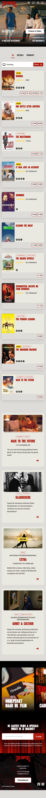
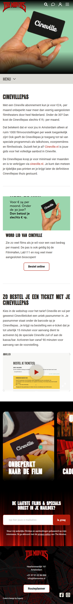
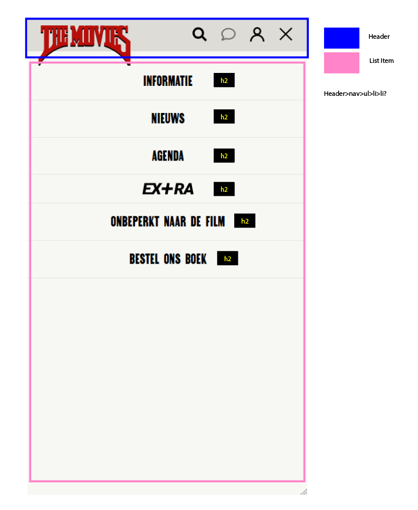

# Procesverslag
Markdown is een simpele manier om HTML te schrijven.  
Markdown cheat cheet: [Hulp bij het schrijven van Markdown](https://github.com/adam-p/markdown-here/wiki/Markdown-Cheatsheet).

Nb. De standaardstructuur en de spartaanse opmaak van de README.md zijn helemaal prima. Het gaat om de inhoud van je procesverslag. Besteedt de tijd voor pracht en praal aan je website.

Nb. Door *open* toe te voegen aan een *details* element kun je deze standaard open zetten. Fijn om dat steeds voor de relevante stuk(ken) te doen.

## Jij

  
uitwerken voor kick-off werkgroep

  ### Auteur:
  Denizay Ogmen

  #### Je startniveau:
  (kies uit zwart, rood óf blauw)
  Blauw

  #### Je focus:
  (kies uit responsive óf surface plane)
  Responsive
 

## Je website

  
uitwerken voor kick-off werkgroep

  ### Je opdracht:
  link naar de website die je gaat namaken óf de naam/omschrijving van je eigen ontwerp

  https://themovies.nl/

  #### Screenshot(s) van de eerste pagina (small screen): 
  Home/landingspagina 
  
  width="375px" alt="Hetzelfde geldt voor de afbeeldingen in de caroussen onderaan">

  #### Screenshot(s) van de tweede pagina (small screen):
  hier de naam van de pagina  
  
 

## Toegankelijkheidstest 1/2 (week 1)

  
uitwerken na test in 2e werkgroep

  ### Bevindingen
  Lijst met je bevindingen die in de test naar voren kwamen:
  - Belemmerd in beweging, kleine knopjes zijn lastig aan te klikken.
  - Maakt het navigeren van de website lastig

  - Wanneer de films veranderen op de Home pagina hoor je helemaal niks over wat voor film het is of dat de slider naar de volgende film gaat. Je krijgt alleen maar te horen dat je op de pagina van de movies zit. verder helemaal niks over de films zelf 

  - Geen narrator voor de navigatie, dus je hebt geen idee waar je bent en wat je op de website kan doen.
  - De filmposterds hebben wel een link die voorgelezen wordt, maar de trailers zitten in een groep waar door je niet hoort welke trailer je aan het kijken bent.
  - De tijden dat de film draait wordt heel random opgenoemd
  - De links bij het zoekbalkje en dan aanbevelingen worden niet verder aangegeven dan het woord 'link'

- De tekst op de pagina van Cineville wordt helemaal niet voorgelezen. 

  - Niet alles wast je op de mobiele versie kan doen kan je op de web versie doen. (caroussel werk niet op web, en hover werkt niet op mobiel)
  - De knop van Tickets & tijden verdwijnt soms?

## Breakdownschets (week 1)

  
uitwerken na afloop 3e werkgroep

  ### de hele pagina: 
  

  ### dynamisch deel (bijv menu): 
  

  ### wellicht nog een dynamisch deel (bijv filter): 
  

## Voortgang 1 (week 2)

  
uitwerken voor 1e voortgang

  ### Stand van zaken
  hier dit ging goed & dit was lastig (neem ook screenshots op van delen van je website en code)

  Ik was begonnen voordat ik de schets had gemaakt maar had daar best wel veel moeite mee. Pas nadat ik voormezelf een duidelijke opstelling had gemaakt begon het kwartje te vallen.
  

  ### Agenda voor meeting
  samen met je groepje opstellen

  | student 1      | student 2          | student 3    | student 4        |
  | ---            | ---                | ---          | ---              |
  | dit bespreken  | en dit             | en ik dit    | en dan ik dat    |
  | en dat ook nog | dit als er tijd is | nog een punt | dit wil ik zeker |
  | ...            | ...                | ...          | ...              |

  ### Verslag van meeting
  hier na afloop snel de uitkomsten van de meeting vastleggen

  - Ik ben nog niet heel erg ver, maar de schets ziet er wel goed uit
  - Html is ook wel netjes alleen nog verder aanvullen maar de basisi opstelling is er

## Voortgang 2 (week 3)

  
uitwerken voor 2e voortgang

  ### Stand van zaken
  hier dit ging goed & dit was lastig (neem ook screenshots op van delen van je website en code)

  Het gaat redelijk de goeie kant op met de html. Ik vind alleen het stijlen wat lastig, maar daar ben ik ook wat dingen aan het proberen. 

  Nu loop ik alleen vast bij de 'filmkaarten' ik kom er niet uit met de grid

  ### Agenda voor meeting
  samen met je groepje opstellen

  | student 1      | student 2          | student 3    | student 4        |
  | ---            | ---                | ---          | ---              |
  | dit bespreken  | en dit             | en ik dit    | en dan ik dat    |
  | en dat ook nog | dit als er tijd is | nog een punt | dit wil ik zeker |
  | ...            | ...                | ...          | ...              |

  ### Verslag van meeting
  hier na afloop snel de uitkomsten van de meeting vastleggen

  - h1 toevoegen eventueel aan het logo
  - maak gebruik van grid
  - direct decended selector .film>ul>li
  - Even kijken komt waarschijnlijk door de pictogrammen, maar nu past het nog niet komt waarschijnlijk door de grid
  - bij de sectie films voor de titel h3 gebruiken. In dit geval zijn Nu, Specials en verwacht de h2
- ...

## Toegankelijkheidstest 2/2 (week 4)

  
uitwerken na test in 9e werkgroep

  ### Bevindingen
  Lijst met je bevindingen die in de test naar voren kwamen (geef ook aan wat er verbeterd is):

## Voortgang 3 (week 4)

  
uitwerken voor 3e voortgang

  ### Stand van zaken
  Ik Loop een beetje vast met de stijling voor films. hoe ik die li'tjes preciesn aan moet pakken.

  ### Agenda voor meeting
  samen met je groepje opstellen

  | student 1      | student 2          | student 3    | student 4        |
  | ---            | ---                | ---          | ---              |
  | dit bespreken  | en dit             | en ik dit    | en dan ik dat    |
  | en dat ook nog | dit als er tijd is | nog een punt | dit wil ik zeker |
  | ...            | ...                | ...          | ...              |

  ### Verslag van meeting
  hier na afloop snel de uitkomsten van de meeting vastleggen

  - Ik mag divjes gebruiken voor de styling in "Films"
  - Goed kijken naar de breakdown van de stukjes in de website
  - Verder met het uitwerken van de nav
  - Verder met styling

## Eindgesprek (week 5)

  
uitwerken voor eindgesprek

  ### Je uitkomst - karakteristiek screenshots:
  

  ### Dit ging goed/Heb ik geleerd: 
  Korte omschrijving met plaatjes

  

  ### Dit was lastig/Is niet gelukt:
  Korte omschrijving met plaatjes

  

## Bronnenlijst

  
continu bijhouden terwijl je werkt

  Nb. Wees specifiek ('css-tricks' als bron is bijv. niet specifiek genoeg). 
  Nb. ChatGpT en andere AI horen er ook bij.
  Nb. Vermeld de bronnen ook in je code.

  1. Chatgpt
  2. Studiegenoten
  3. ...

